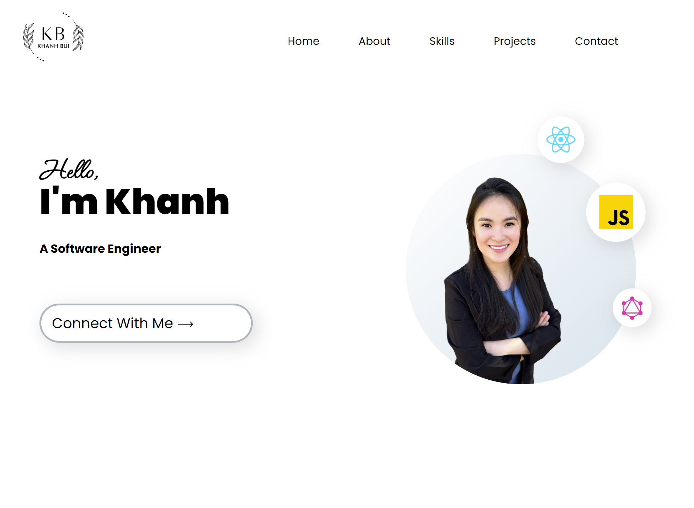

# Welcome to Khanh Bui's portfolio!!! 👋

Creative and enthusiastic developer with prior experience in customer
service and sales. Team work makes the dream work, so collaborating to
drive the team's success is a must. Developed & honed skills with a
Full-Stack Web Development Certificate from Georgia Institute of
Technology. Determined, self-driven and enjoy the challenges of complex
problem solving.
 
 

 
 
Link: https://khanhpbui.github.io/kbui-portfolio/

## Table Of Contents 
 - [Technical Skills](#technical-skills)
 - [License](#license)
 - [Resources](#resources)
 - [Questions](#questions)

 ## Technical Skills
- HTML5, CSS3, JavaScript, Handlebars.js, jQuery, Bootstrap, Tailwind, React
API, REST, HTTP Request
- MySQL, Sequelize, NoSQL, MongoDB, Mongoose, Jest, Node.js, Express.js
- Heroku, Git, GitHub, Git Bash, Visual Studio Code, NPM, Insomnia

## License
    

## Resources

[Online Tutorials](https://www.youtube.com/@OnlineTutorialsYT)

## Questions
    
If there are any questions or concerns, please contact me at: 
[GitHub](https://github.com/khanhpbui) 
[Email](mailto:pkkhanhbui@gmail.com)
